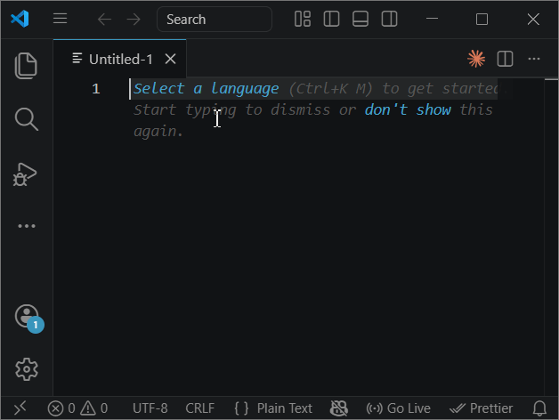

<p align="center">
  
</p>

<h1 align="center">Win Whisper</h1>

<p align="center">
  🎙️ Local, offline voice-to-text for Windows<br>
  Hold a key, speak, release — text appears wherever you type
</p>

<p align="center">
  <a href="https://github.com/kalikin-artem/win-whisper/releases"></a>&nbsp;
  &nbsp;
  <a href="https://github.com/kalikin-artem/win-whisper/blob/main/LICENSE"></a>&nbsp;
  <a href="https://ko-fi.com/kalikin"></a>
</p>

<p align="center">
  <a href="https://github.com/kalikin-artem/win-whisper/releases">⬇️ Download</a>&nbsp;&nbsp;·&nbsp;&nbsp;
  <a href="#how-it-works">How it works</a>&nbsp;&nbsp;·&nbsp;&nbsp;
  <a href="#configuration">Configuration</a>&nbsp;&nbsp;·&nbsp;&nbsp;
  <a href="#models">Models</a>
</p>

---

## Getting started

1. Download **win-whisper.exe** from the [latest release](https://github.com/kalikin-artem/win-whisper/releases)
2. Run it — a small icon appears in your system tray
3. Wait for the **"Ready"** notification (first launch downloads the model, ~145 MB)

That's it. No installation, no Python, no setup. Works fully offline after the first run.

## How it works

1. 🟢 **Hold F9** — recording starts
2. 🎤 **Speak** — say anything in any language
3. 🔴 **Release F9** — text is transcribed and pasted into the active window

> 💡 Right-click the tray icon to switch models, reload, or exit.



## Configuration

On first run, a `config.json` file is created next to the executable:

```json
{
  "model": "base",
  "hotkey": "f9",
  "paste_hotkey": "ctrl+v",
  "language": null,
  "device": "cpu"
}
```

| Option         | Description                                                                | Default    |
| -------------- | -------------------------------------------------------------------------- | ---------- |
| `model`        | Whisper model size — see [Models](#models) below                           | `"base"`   |
| `hotkey`       | Key to hold while speaking                                                 | `"f9"`     |
| `paste_hotkey` | Key combination used to paste the text                                     | `"ctrl+v"` |
| `language`     | Force a specific language (`"en"`, `"uk"`, etc.) or `null` for auto-detect | `null`     |
| `device`       | Inference device: `"cpu"` or `"cuda"` for NVIDIA GPU                       | `"cpu"`    |

Edit the file and restart the app to apply changes.

## Models

All models auto-detect the language (90+ supported). Powered by [Faster Whisper](https://github.com/SYSTRAN/faster-whisper) (CTranslate2).

| Model    | Download size | Speed  | Accuracy |
| -------- | :-----------: | :----: | :------: |
| `tiny`   |     75 MB     | ⚡⚡⚡ |   ★☆☆    |
| `base`   |    145 MB     |  ⚡⚡  |   ★★☆    |
| `small`  |    240 MB     |   ⚡   |   ★★★    |
| `medium` |    770 MB     |   🐢   |   ★★★★   |

You can also switch models from the tray icon menu without editing the config.

## Troubleshooting

<details>
<summary><strong>Windows SmartScreen blocked the app</strong></summary>

Windows may show **"Windows protected your PC"** because the app is not code-signed. To fix:

1. Right-click `win-whisper.exe` → **Properties**
2. Check **Unblock** at the bottom → **OK**
3. Run the app normally
</details>

| Problem               | Fix                                                                           |
| --------------------- | ----------------------------------------------------------------------------- |
| Nothing happens       | Check `win-whisper.log` next to the executable                                |
| "No speech"           | Speak louder or hold longer. Check your default mic in Windows Sound settings |
| Want GPU acceleration | Set `"device": "cuda"` in `config.json` (requires NVIDIA GPU with CUDA)       |

<details>
<summary><strong>Run from source</strong></summary>

Requires Python 3.10+ and Windows 10/11.

```bash
pip install .
win-whisper
```

Or without installing:

```bash
pip install -r requirements.txt
python -m win_whisper
```
</details>

## License

MIT — [Artem Kalikin](mailto:artem@kalikin.org)
